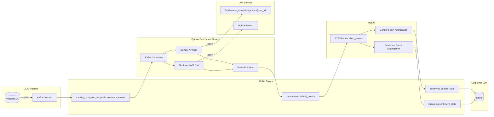

# Streaming Aggregation Feature Plan (Hybrid: Python + ksqlDB)

## Architecture Overview




## Two-Stage Pipeline

### Stage 1: Python Enrichment Service

Consumes raw CDC events, enriches via HTTP APIs, produces to intermediate topic.

**Input Topic**: `tracking_postgres_cdc.public.comment_events`

```json
{
  "comment_id": 12345,
  "user_id": "A1B2C3D4",
  "comments": "This product is amazing!",
  "event_timestamp": 1709546700000
}
```

**Output Topic**: `streaming.enriched_events`

```json
{
  "comment_id": 12345,
  "user_id": "A1B2C3D4",
  "comments": "This product is amazing!",
  "gender": "female",
  "sentiment": "positive",
  "event_timestamp": 1709546700000
}
```

### Stage 2: ksqlDB Aggregation

SQL-based 5-minute tumbling window aggregation on enriched events.

## Implementation Details

### File Structure

```
src/streaming/
├── main.py                    # Python enrichment service entry point
├── config.py                  # Configuration (Kafka, API endpoints)
├── models.py                  # Pydantic models
├── enrichment/
│   ├── __init__.py
│   ├── client.py              # Async HTTP client for API calls
│   └── processor.py           # Main enrichment logic
└── ksql/
    ├── 01_create_streams.sql  # Create source stream from enriched topic
    ├── 02_gender_agg.sql      # Gender aggregation query
    └── 03_sentiment_agg.sql   # Sentiment aggregation query
```

### Key Components

**1. Python Enrichment Service** ([src/streaming/main.py](src/streaming/main.py))

- Kafka consumer (confluent-kafka) for CDC topic
- Async HTTP calls to gender and sentiment APIs using `httpx`
- Kafka producer to enriched events topic
- Error handling: API failures result in "unknown" values

**2. ksqlDB Statements**

**Create Stream** ([src/streaming/ksql/01_create_streams.sql](src/streaming/ksql/01_create_streams.sql)):

```sql
CREATE STREAM enriched_events (
    comment_id BIGINT,
    user_id VARCHAR,
    comments VARCHAR,
    gender VARCHAR,
    sentiment VARCHAR,
    event_timestamp BIGINT
) WITH (
    KAFKA_TOPIC='streaming.enriched_events',
    VALUE_FORMAT='JSON',
    TIMESTAMP='event_timestamp'
);
```

**Gender Aggregation** ([src/streaming/ksql/02_gender_agg.sql](src/streaming/ksql/02_gender_agg.sql)):

```sql
CREATE TABLE gender_stats WITH (KAFKA_TOPIC='streaming.gender_stats') AS
SELECT
    WINDOWSTART AS window_start,
    WINDOWEND AS window_end,
    COUNT(*) AS total_count,
    COUNT_DISTINCT(CASE WHEN gender = 'male' THEN comment_id END) AS male_count,
    COUNT_DISTINCT(CASE WHEN gender = 'female' THEN comment_id END) AS female_count,
    COUNT_DISTINCT(CASE WHEN gender = 'unknown' THEN comment_id END) AS unknown_count
FROM enriched_events
WINDOW TUMBLING (SIZE 5 MINUTES)
GROUP BY 1
EMIT FINAL;
```

**Sentiment Aggregation** ([src/streaming/ksql/03_sentiment_agg.sql](src/streaming/ksql/03_sentiment_agg.sql)):

```sql
CREATE TABLE sentiment_stats WITH (KAFKA_TOPIC='streaming.sentiment_stats') AS
SELECT
    WINDOWSTART AS window_start,
    WINDOWEND AS window_end,
    COUNT(*) AS total_count,
    COUNT_DISTINCT(CASE WHEN sentiment = 'positive' THEN comment_id END) AS positive_count,
    COUNT_DISTINCT(CASE WHEN sentiment = 'negative' THEN comment_id END) AS negative_count,
    COUNT_DISTINCT(CASE WHEN sentiment = 'unknown' THEN comment_id END) AS unknown_count
FROM enriched_events
WINDOW TUMBLING (SIZE 5 MINUTES)
GROUP BY 1
EMIT FINAL;
```

### Docker Compose Additions

**ksqlDB Server**:

```yaml
ksqldb-server:
  image: confluentinc/ksqldb-server:0.29.0
  container_name: ksqldb-server
  profiles: ["streaming", "full"]
  depends_on:
    kafka-1:
      condition: service_healthy
    schema-registry:
      condition: service_healthy
  ports:
    - "8088:8088"
  environment:
    KSQL_BOOTSTRAP_SERVERS: kafka-1:9094,kafka-2:9094,kafka-3:9094
    KSQL_LISTENERS: http://0.0.0.0:8088
    KSQL_KSQL_SCHEMA_REGISTRY_URL: http://schema-registry:8081
    KSQL_KSQL_LOGGING_PROCESSING_STREAM_AUTO_CREATE: "true"
    KSQL_KSQL_LOGGING_PROCESSING_TOPIC_AUTO_CREATE: "true"
  networks:
    - mlops-k6-network
```

**Python Enrichment Service**:

```yaml
streaming-enrichment:
  container_name: streaming-enrichment
  profiles: ["streaming", "full"]
  build:
    context: .
    dockerfile: ./docker/streaming/Dockerfile
  depends_on:
    kafka-1:
      condition: service_healthy
    livestream-agent:
      condition: service_started
  environment:
    KAFKA_BOOTSTRAP_SERVERS: kafka-1:9094,kafka-2:9094,kafka-3:9094
    API_BASE_URL: http://livestream-agent:8000
    INPUT_TOPIC: tracking_postgres_cdc.public.comment_events
    OUTPUT_TOPIC: streaming.enriched_events
  networks:
    - mlops-k6-network
```

### Output Schema for LLM

The ksqlDB aggregation topics produce:

**Gender Stats** (`streaming.gender_stats`):

```json
{
  "window_start": 1709546400000,
  "window_end": 1709546700000,
  "total_count": 150,
  "male_count": 68,
  "female_count": 78,
  "unknown_count": 4
}
```

**Sentiment Stats** (`streaming.sentiment_stats`):

```json
{
  "window_start": 1709546400000,
  "window_end": 1709546700000,
  "total_count": 150,
  "positive_count": 52,
  "negative_count": 38,
  "unknown_count": 60
}
```

A downstream consumer (or the LLM agent) can calculate percentages from these counts.

## Benefits of Hybrid Approach

1. **Python Enrichment**: Full flexibility for HTTP API calls, error handling, retries, caching
2. **ksqlDB Aggregation**: Battle-tested windowing, exactly-once semantics, SQL simplicity
3. **Decoupled**: Each component can be scaled/debugged independently
4. **Fault Tolerant**: Kafka topics between stages provide natural buffering and replay capability

## Error Handling

- **API timeout/failure**: Python service marks gender/sentiment as "unknown"
- **ksqlDB failure**: Enriched events remain in Kafka topic, can be reprocessed
- **Consumer lag**: Monitor via Kafka UI, scale Python service horizontally if needed

